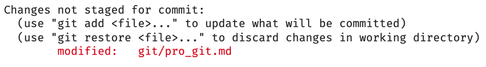
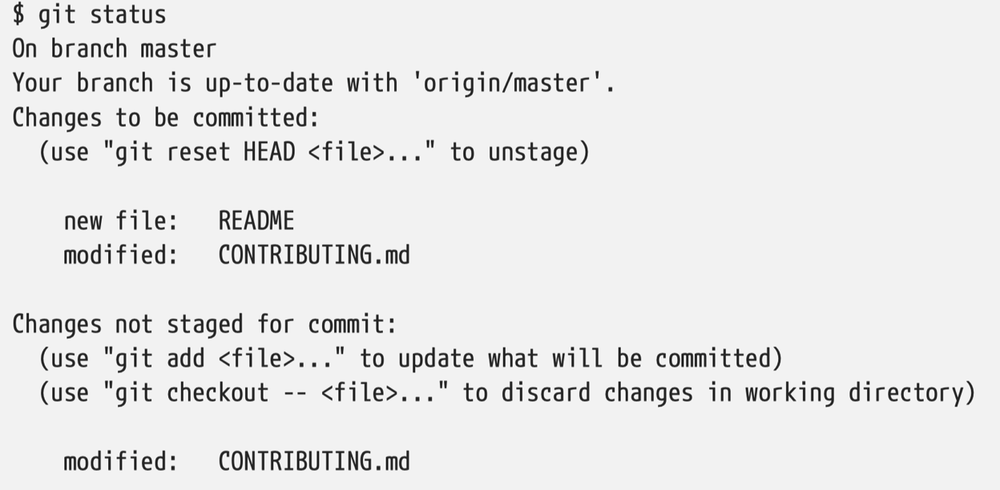
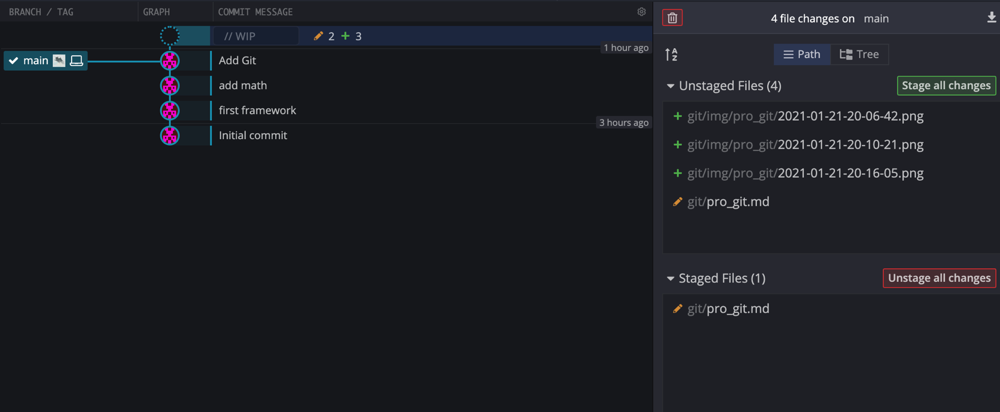
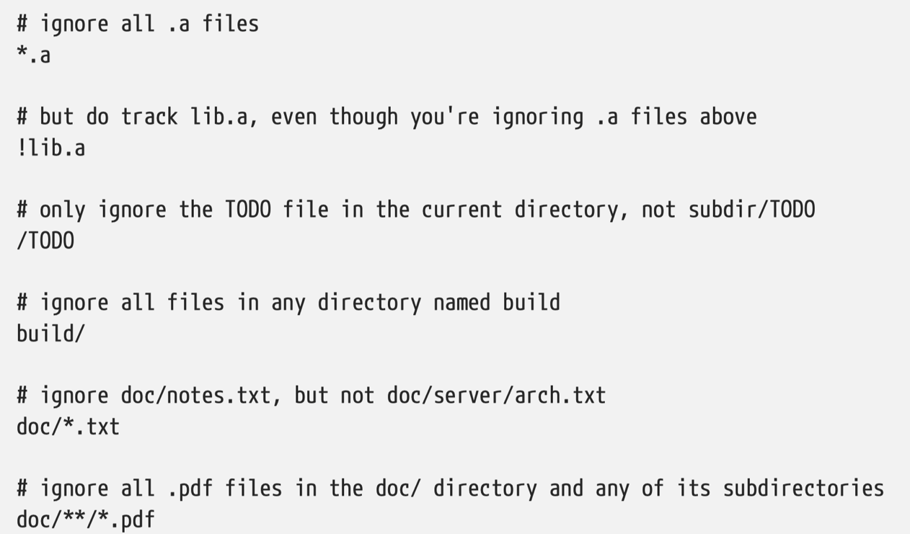
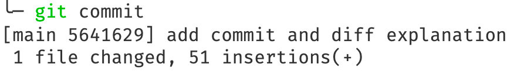
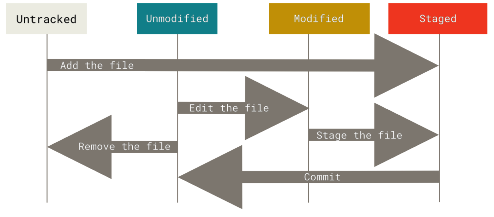

## General

- install : https://git-scm.com/download/
- setting ~/.gitconfig
- Git needs the following information to know who commits

```bash
git config --global user.name "John Doe"
git config --global user.email johndoe@example.com
```

- When you `git init`, a branch called `master` or `main` depending on your git version is created.

## Starting point

- create a repository
  `git init`
- track files
  `git add *.c`
- clone a repository
  `git clone rep yourfolder(optional)`

each file has two states: tracked or untracked

once tracked it has two states: modified and unmodifed

Once commited, it's called staged

If modified but not commited, you see the following notification when running `git status`. Note the red text.



Run `git add file` to stage the file (which doesn't mean it's commited)

If you modify a file after you run git add, you have to run git add again to stage the latest version of the file. See the following snapshot:



The `contributing.md` is both staged and not staged because it has been modified since the last `git add`

Sometimes use a GUI interface like [GitKraken](https://www.gitkraken.com/) is a good idea. See the screenshot below.



Use `git status -s` to get a concise report.

💯 Setting up a `.gitignore` file for your new repository **before** you get going is generally a good idea. `/` is to avoir recursivity and `/` at the end is to specify a directory. An exemple:



For python template, see [here](https://github.com/github/gitignore/blob/master/Python.gitignore). For other languages, see [here](https://github.com/github/gitignore)

## Intermediate

`git diff` by itself doesn’t show all changes made since your last commit — only changes that are still unstaged. If you’ve staged all of your changes, `git diff` will give you no output. Instead, use `git diff --staged`. `git --cached` is a synonym.

Often people use `git commit -m message` directly, at the base level, `git commit` works, and you would enter the commit message using your text editor set by `git config --global core.editor`.

After you make a commit (you have to make a commit message whether you use `-m` or not). You get this kind of feedback. `main` is the branch, `5641629` is the SHA-1 checksum and the rest is statistics.



Finally you can also use `git commit -a -m message` to skip the staging part. Adding the -a option to the git commit command makes Git automatically stage every file that is already tracked before doing the commit, letting you skip the git add part.

This is the lifecycle of the status of your files.



## Step back

- remove files
